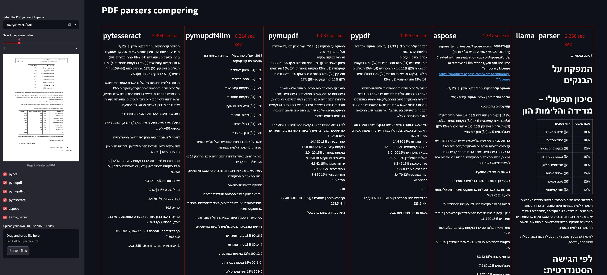

**PDF-Parser-Comparator**
=========================

A comparative analysis tool for PDF parsing libraries. This Streamlit app allows users to test different parsers on their own PDFs and view performance metrics in real-time

 <!-- <iframe src="https://giphy.com/embed/dwQdjnyyrI4hHcv1G3" width="480" height="271" style="" frameBorder="0" class="giphy-embed" allowFullScreen></iframe>
<a href="https://giphy.com/stickers/show-ossur-ilimb-dwQdjnyyrI4hHcv1G3">via GIPHY</a>
 -->

 [pdf-extractor-comparator.streamlit.app](https://pdf-extractor-comparator.streamlit.app/)

Table of Contents
-----------------

* [Description](#description)
* [Features](#features)
* [Requirements](#requirements)
* [Installation](#installation)
* [Contributing](#contributing)
* [License](#license)

**Description**
---------------

The PDF-Parser-Comparator is a Streamlit app that allows users to compare the performance of various PDF parsing
methods. With this tool, you can easily upload or select a PDF from the dropdown list and test different parsers
on your own PDFs.

**Features**
------------

* Compare the execution time of multiple PDF parsing libraries (pypdf, pymupdf, pymupdf4llm, pytesseract, aspose,
and llama_parser)
* Select a PDF from the dropdown list or upload your own
* View performance metrics for each parser in real-time
* Intuitive Streamlit interface for easy usage

**Requirements**
----------------

* Python 3.11
* Streamlit 1.38
* pypdf, pymupdf, pymupdf4llm, pytesseract, aspose, and llama_parser, pdfplumber (requirements.txt)

**Local Installation**
---------------

1. Clone this repository: `git clone https://github.com/NirAharon1/PDF-Parser-Comparator.git`
2. Install the required dependencies: `pip install -r requirements.txt`
3. Run the app: `streamlit run streamlit_app.py`

**Contributing**
---------------

 Contributions are welcome! If you'd like to add a new feature or fix an issue, please submit a pull request.

**License**
-----------

This project is licensed under the MIT License. See LICENSE.txt for details.